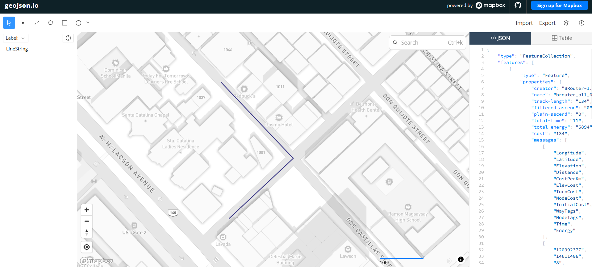

# BRouter — Developer Guide

`BRotuer` is a configurable offline routing engine, designed to calculate optimal routes using OpenStreetMap and elevation data. While designed initially for biking, its multi-modal support allows users to create custom profiles for various uses.
 

## Deployment
The project's BRouter engine can be reached through the project's Tailscale network using its Tailnet IP address or its MagicDNS at:

```
http://brouter:17777/brouter
```

This deployment is built from the [official repository](https://github.com/abrensch/brouter)'s docker image on a Virtual Machine (as recommended by Docker) with the following provisions:

```
Type: VM
OS: Ubuntu Server 24.04
CPU: 2 cores
RAM: 1024 MB
Disk: 20 GB
```

It is currently loaded with all map segments officially released via `https://brouter.de/brouter/segments4/` for the **Philippines only**.


## API Usage

The routing API does not require a token or any authorization header. It will require the following parameters in order to return a valid response:

1. `lonlats` - At least 2 pairs of `lon,lat` points separated by a single pipe character (`|`) in between.
2. `profile` - The profile that defines the preferences for choosing a route. Use `all` for querying the linestring for flood paths (finds the shortest path). Use `trekking` for calculating evacuation routes. 
> Note: A custom profile penalizing active flood paths based on height will be created for this project. Check this documentation file for updates on the final evacuation routing profile.
3. `format` - Specifies the return format for the geographic data. Use `geojson`, which is the format supported by Leaflet and OpenLayers.

### Example Query
```
http://brouter:17777/brouter?lonlats=120.9920343,14.6109531|120.9923311,14.6114086|120.9919167,14.6118874&profile=all&format=geojson
```

| Key | Value |
|---|---|
| `lonlats` | 120.9920343,14.6109531|120.9923311,14.6114086|120.9919167,14.6118874 |
| `profile` | all |
| `format` | geojson |

### Example JSON Response

```
{
    "type": "FeatureCollection",
    "features": [
        {
            "type": "Feature",
            "properties": {
                "creator": "BRouter-1.7.10-beta",
                "name": "brouter_all_0",
                "track-length": "134",
                "filtered ascend": "0",
                "plain-ascend": "0",
                "total-time": "11",
                "total-energy": "5894",
                "cost": "134",
                "messages": [
                    [
                        "Longitude",
                        "Latitude",
                        "Elevation",
                        "Distance",
                        "CostPerKm",
                        "ElevCost",
                        "TurnCost",
                        "NodeCost",
                        "InitialCost",
                        "WayTags",
                        "NodeTags",
                        "Time",
                        "Energy"
                    ],
                    [
                        "120992377",
                        "14611406",
                        "8",
                        "61",
                        "1000",
                        "0",
                        "0",
                        "0",
                        "0",
                        "reversedirection=yes highway=tertiary",
                        "",
                        "4",
                        "2683"
                    ],
                    [
                        "120991911",
                        "14611882",
                        "8",
                        "73",
                        "1000",
                        "0",
                        "0",
                        "0",
                        "0",
                        "highway=residential",
                        "",
                        "10",
                        "5894"
                    ]
                ],
                "times": [
                    0,
                    4.88,
                    5.2,
                    10.72
                ]
            },
            "geometry": {
                "type": "LineString",
                "coordinates": [
                    [
                        120.991961,
                        14.611027,
                        8.0
                    ],
                    [
                        120.992377,
                        14.611406,
                        8.0
                    ],
                    [
                        120.992353,
                        14.611429,
                        8.0
                    ],
                    [
                        120.991911,
                        14.611882,
                        8.0
                    ]
                ]
            }
        }
    ]
}

```

The provided linestring can be quickly checked on [geojson.io](https://geojson.io/next/)` by pasting the feature set in the json panel. The path will be rendered on the map as follows:


